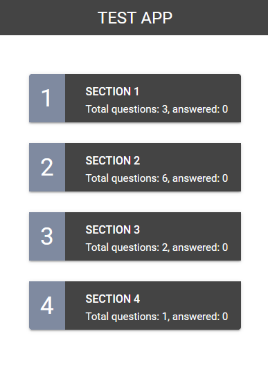

# Challenge Disney

I made this app with Angular 14 and with Angular Material UI

# To do

- Finish dependentQuestion
- More coverage with test
- Deploy on bucket S3 Amazon

### How to Start

- git clone https://github.com/IanRivas/challenge-disney.git
- cd challenge-disney
- npm install
- npm run start
